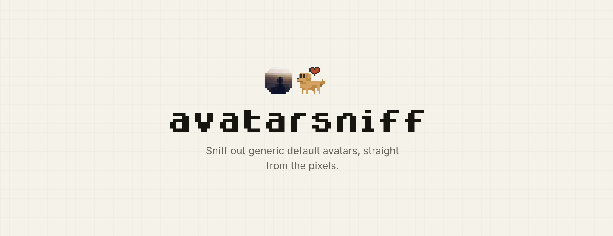

<p align="center">
  <a href="https://avatarsniff.tunc.co">
    
  </a>
</p>

# avatarsniff

[](https://www.npmjs.com/package/avatarsniff)
[](https://bundlephobia.com/package/avatarsniff)
[](https://www.npmjs.com/package/avatarsniff?activeTab=dependencies)
[](https://www.npmjs.com/package/avatarsniff)
[](./LICENSE)

Detect the generic, auto-generated avatars providers hand out when someone never
set a profile picture: Google's letter-on-a-colour, flat solid-colour blocks, the
Gravatar mystery-person silhouette, GitHub and Gravatar identicons. It reads the
image pixels directly, so you can catch a default and replace it with something
of your own.

Try it: [avatarsniff.tunc.co](https://avatarsniff.tunc.co)

## Install

```sh
npm  install avatarsniff
pnpm add     avatarsniff
yarn add     avatarsniff
```

```ts
import { sniff } from "avatarsniff";

const result = await sniff(bytesOrUrl);
if (result?.isDefault) {
  // a generic provider default; result.matched says which kind
}
```

The full API, the decoding matrix, and the opt-in WEBP/SVG subpaths are in
[`lib/README.md`](./lib/README.md).

## What's in here

- [`lib/`](./lib) is the [`avatarsniff`](https://www.npmjs.com/package/avatarsniff)
  package: framework- and runtime-agnostic, zero install dependencies.
- [`site/`](./site) is the [live demo](https://avatarsniff.tunc.co), a small Next.js app.

## Develop

```sh
pnpm install

pnpm --filter avatarsniff typecheck
pnpm --filter avatarsniff test
pnpm --filter avatarsniff build
```

## License

[MIT](./LICENSE) © Tunç Türkmen
